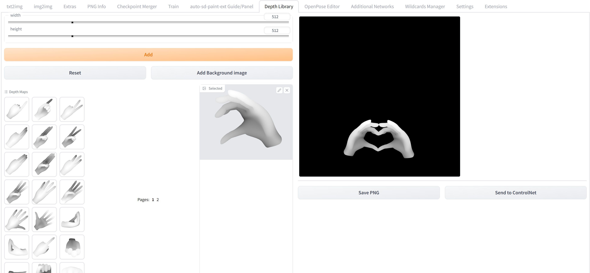

## Depth map library and poser
Depth map library for use with the [Control Net extension](https://github.com/Mikubill/sd-webui-controlnet) for [Automatic1111/stable-diffusion-webui](https://github.com/AUTOMATIC1111/stable-diffusion-webui)

## Installation
1. Open the "Extension" tab
2. Click on "Install from URL"
3. In "URL for extension's git repository" enter this extension, https://github.com/jexom/sd-webui-depth-lib.git
4. Click "Install"
5. Restart WebUI

## Adding own maps
To add own depth maps permanently put them in the `extensions/sd-webui-depth-lib/maps/<category>` folder where `<category>` is a folder with the name of the category tab you want, see the examle `shapes` folder

## Attention
Do not select anything for the Preprocessor in ControlNet.
